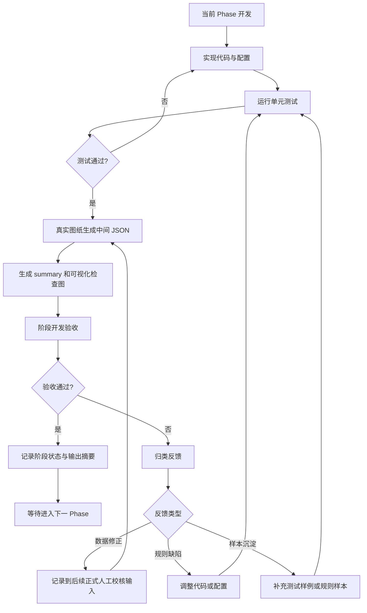
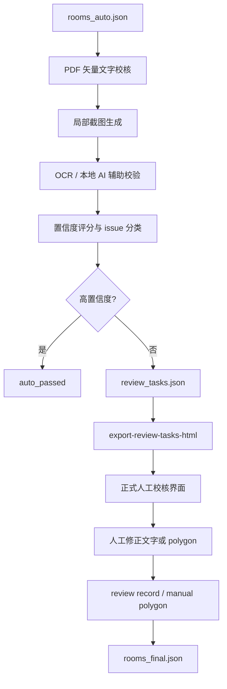

# 项目进展

## 当前状态

项目已完成 Phase 0 / Phase 1 / Phase 2 / Phase 3 / Phase 4 / Phase 5 / Phase 6 的基础工程、真实文件验证、DWG 到 DXF 的本地转换能力、轴线 JSON 提取与人工校核 HTML、结构柱 JSON 提取与叠加校核 HTML、房间文字识别和 label 聚类、房间边界识别、初始房间 JSON 生成、PDF 矢量文字机器校核，以及 PDF 局部截图生成。本地 AI 辅助校验已完成真实调用并生成中间结果。

当前验证环境：

- Windows
- Python 3.12
- AutoCAD 2024
- `AcCoreConsole.exe`

## 当前工作流程

当前代码已按两个主工作流组织：

1. Workflow A：DXF preparation
   - DWG/DXF 输入标准化
   - AutoCAD `AcCoreConsole.exe` 调用
   - DWG 转 DXF
   - DXF 炸块
   - 炸块后线性图元去重
   - 产物 DXF 管理
2. Workflow B：Room extraction
   - DXF 解析
   - 轴线 / 柱子辅助抽取
   - 房间文本识别
   - 房间边界识别
   - Room JSON 生成
   - PDF / 本地 AI / 正式人工校核

项目根目录入口：

- `dxf_preparation.py`：Workflow A 专用入口，文件头已补充中文 docstring，说明 DXF 预处理功能、用途、子命令和主要参数范围。
- `room_extraction.py`：Workflow B 专用入口，文件头已补充中文 docstring，说明房间提取流程、用途、输入输出参数、PDF / AI / HTML 导出相关参数和子命令范围。

两个根目录入口均只负责把项目 `src` 目录加入 Python 模块搜索路径，并把参数透传给 `src/room_extractor/cli/` 下的正式 CLI。业务参数仍由 workflow 注册函数统一维护，避免根目录入口和安装入口出现两套参数定义。

安装入口：

- `room-extractor`：统一入口，暴露两个 workflow 的全部命令。

当前项目按 Phase 递进，但需要区分“阶段开发验收”和“正式人工校核”。

阶段开发验收用于确认当前 Phase 的中间产物是否可继续下一 Phase。它可以使用 JSON、summary 和可视化检查图，但不等同于最终业务人工校核。

Phase 3 起，人工不直接验收纯 JSON。边界类结果可以生成可视化检查图，将 CAD 底图、识别 polygon、label、状态和 issue 叠加展示，人工据此与图纸轮廓比对；该图只用于阶段开发验收和规则诊断，不进入正式人工审核链路。

正式人工校核应放在机器校验之后，即 PDF 矢量文字校核、局部截图、OCR / 本地 AI 辅助校验、置信度评分和 review task 生成之后再进行，并使用 `review_tasks.json` 导出的正式人工审核 HTML。

已执行的实际流程：

1. Phase 0 / Phase 1 完成基础工程和 DXF 原始解析。
2. 使用真实 DWG 转换后的 DXF 生成 `cad_raw_real.json`。
3. 人工确认 DWG 转 DXF 后的 DXF 显示正常。
4. Phase 2 生成 `room_label_candidates_real.json`。
5. 人工检查 Phase 2 输出后，确认进入 Phase 3。
6. Phase 3 生成 `room_candidates_real.json`。
7. 阶段开发验收发现未匹配项过多后，回到 Phase 3 调整规则：
   - 增加 fallback 低置信度匹配。
   - 增加特殊空间分类。
   - 增加具体 issue code。
   - 增加顶层 `summary`。
8. 新增 Phase 3 HTML/SVG 阶段检查图，避免开发阶段直接阅读纯 JSON；该图已限定为诊断产物。
9. Phase 4 生成 `rooms_auto_real.json`。
10. Phase 5 读取真实 PDF，提取 PDF 矢量文字并生成 `rooms_pdf_checked_real.json`。
11. Phase 6 根据 `rooms_pdf_checked_real.json` 生成 PDF 局部截图，并写回 `review_image` evidence。
12. 本地 AI 辅助校验入口 `check-images-ai` 完成结构验证。
13. 新增正式人工审核 HTML 导出，从 `review_tasks.json` 展示 PDF 局部截图、自动字段、AI 判断、issue 和 CAD 几何预览。
14. 重新运行测试和真实图纸输出。
15. 新增轴线专项提取：按 `A-GRID` 轴线图层和 `A-ANNO-TXT` 轴号图层生成 `cad_raw_axis_check.json`。
16. 新增 `export-json-review-html`，用于生成 `JSON人工校核` HTML，可叠加多个 JSON 数据源，并通过页面顶部开关控制显示内容。
17. 新增结构柱专项提取：按 `A-STR-COLM` 等结构柱图层从 DXF 的 HATCH 边界生成独立 `columns` JSON 数据。
18. 扩展 `export-json-review-html`，支持叠加显示 `columns`，可将轴线 JSON 与结构柱 JSON 同页校核。

当前执行规范：

1. 每个 Phase 必须有中间 JSON。
2. 每个 Phase 必须用真实图纸跑通。
3. 阶段开发验收未通过时，不进入下一 Phase。
4. 阶段反馈先归类为数据修正、规则缺陷或样本沉淀。
5. 规则缺陷必须调整代码或配置，并重新生成中间 JSON。
6. 有复用价值的问题必须补测试或规则说明。
7. 正式人工校核结果优先级高于自动规则。
8. 正式人工校核应排在 PDF / OCR / 本地 AI / 置信度评分之后。
9. Phase 3 的 `room_candidates_review*.html` 只作为阶段诊断产物，不作为正式人工审核入口。

阶段开发验收流程图：



正式机器校验与人工校核流程图：



## 已完成

### Phase 0：项目初始化

- 创建 `src/room_extractor` 包结构。
- 创建 `pyproject.toml`、`requirements.txt`、`.gitignore`、`.gitattributes`。
- 创建 CLI 入口 `room-extractor`。
- 根目录 `main.py` 已在 Workflow 重构中移除。
- 新增根目录 `dxf_preparation.py` 和 `room_extraction.py`，分别作为两个主工作流的专用入口。
- 根目录两个入口文件已补充中文模块 docstring，记录功能介绍、用途、处理流程和主要命令行参数说明。
- 安装后的统一 CLI 入口仍为 `room-extractor`。
- 创建基础 Pydantic models：
  - `Room`
  - `Drawing`
  - `Geometry`
  - `Confidence`
  - `Issue`
  - `ReviewRecord`
- 将日志配置迁移到 `src/room_extractor/utils/logging_config.py`。

### Phase 1：DXF 基础解析

- 实现 DXF 文件加载。
- 实现图层统计：
  - 图层名称
  - 实体数量
  - `TEXT`
  - `MTEXT`
  - `INSERT`
  - `LWPOLYLINE`
  - closed `LWPOLYLINE`
- 实现 CAD 原始对象提取：
  - `TEXT / MTEXT`
  - `INSERT` attributes
  - `LWPOLYLINE / POLYLINE`
  - AXIS 图层中的 `LINE / LWPOLYLINE / POLYLINE / ARC`
  - bbox
  - polygon area
- 实现轴线专项提取：
  - 默认轴线图层：`A-GRID`
  - 默认轴号图层：`A-ANNO-TXT`
  - 规则文件：`src/room_extractor/config/axis_layer_rules.yaml`
  - 支持 `extract-cad --axis-only`
  - 支持 `extract-cad --axis-rules <yaml>`
  - 弧形轴线按点列输出，首尾相接弧段合并为一根曲线轴线
- 实现结构柱专项提取：
  - 默认结构柱图层：`A-STR-COLM`
  - 规则文件：`src/room_extractor/config/column_layer_rules.yaml`
  - 支持 `extract-cad --columns-only`
  - 支持 `extract-cad --column-rules <yaml>`
  - 支持 `analyze-column-features`，从已确认的柱 DXF 样本统计可复用特征
  - 支持展开 `INSERT.virtual_entities()`，可从未手工冻结/隐藏的全量 DXF 中抽取块或外参内部柱图元
  - 支持按实体类型、颜色、HATCH 填充、最大宽高和最大面积过滤柱候选
  - 从 HATCH 边界提取柱 polygon、bbox、center、area、width、height
  - 对多路径 HATCH 先取最大边界作为柱外轮廓，避免内外边界重复输出
- 实现 `analyze-layers` 命令。
- 实现 `extract-cad` 命令。
- 对非 DXF 输入给出清晰错误，不再抛 traceback。

### DWG 转 DXF

- 新增 `convert-dwg` 命令。
- 使用 AutoCAD `AcCoreConsole.exe` 无界面转换，不调用 AutoCAD 窗口。
- 使用临时 `.scr` 脚本执行 `_DXFOUT`。
- 为避免中文路径被 AutoCAD 脚本解析错误，转换时先复制到临时 ASCII 工作目录，成功后再移动到目标中文路径。
- 支持：
  - `--input-dir`
  - `--output-dir`
  - `--recursive`
  - `--overwrite`
  - `--accoreconsole`
  - `--locale`
  - `--timeout-seconds`
  - `--dxf-precision`
  - `--keep-scripts`

### Phase 2：房间文字识别

- 新增 `build-room-labels` 命令。
- 从 Phase 1 输出的 `cad_raw.json` 读取 CAD 文本。
- 实现 CAD 文本标准化：
  - 去除多余空白
  - 统一面积单位
  - 恢复常见 GBK mojibake 中文文本
- 实现字段识别：
  - 面积：`25.60㎡`、`25.60m²`、`25.60m2`、`面积：25.60`
  - 房号：`B1-023`、`101`、`会议室 252` 等常见形式
  - 房名：办公室、会议室、贵宾室、卫生间、电梯厅、服务间、后勤用房等常见房间名称
- 实现相邻文本聚类，将房号、房名、面积合并为 `room_label_candidates.json`。
- 每个候选包含：
  - `candidate_id`
  - `floor`
  - `room_number`
  - `room_name`
  - `area`
  - `center`
  - `bbox`
  - `source_texts`
  - `confidence`
  - `issues`

### Phase 3：房间边界识别

- 新增 `build-room-candidates` 命令。
- 从 Phase 1 输出的 `cad_raw.json` 读取闭合 polyline。
- 过滤过小 / 过大的 polygon，保留候选房间边界。
- 每个边界候选输出：
  - `boundary_id`
  - `source_polyline_index`
  - `layer`
  - `polygon_cad`
  - `bbox_cad`
  - `area_cad`
- 读取 Phase 2 的 `room_label_candidates.json`。
- 使用 label 中心点匹配包含它的 polygon。
- 当多个 polygon 同时包含 label 时：
  - 优先房间边界 / 面积线图层
  - 再选择面积最小的合适 polygon
- 普通房间中心点未落入 polygon 时，支持按优先边界图层 bbox 距离进行低置信度 fallback 匹配。
- fallback 匹配输出 `matched_fallback`，并写入 `LABEL_OUTSIDE_BOUNDARY_FALLBACK_MATCH` issue。
- 客梯、货梯、电梯厅、走道、通道等特殊空间无面积时不强行 fallback，输出 `SPECIAL_SPACE_NO_AREA_BOUNDARY`，等待人工确认是否作为房间输出。
- 匹配失败时输出 `auto_failed`，并写入具体 issue code。
- 顶层 `summary` 输出状态、匹配方式和 issue 统计摘要。
- 输出 `room_candidates.json`。
- 新增 `export-review-map` 命令，输出 HTML/SVG 阶段检查图。
- 阶段检查图包含 CAD 线框底图、严格匹配 polygon、fallback polygon、未匹配 label、候选列表和 summary。
- 该阶段检查图仅用于 Phase 3 规则诊断，正式人工审核改由 PDF / OCR / 本地 AI 后的 review task HTML 承担。

### Phase 4：生成初始房间 JSON

- 新增 `build-rooms` 命令。
- 从 Phase 3 输出的 `room_candidates.json` 生成 `rooms_auto.json`。
- 每个房间输出标准 `Room` 对象：
  - `room_uid`
  - `basic_info`
  - `area`
  - `geometry`
  - `evidence`
  - `confidence`
  - `review`
  - `issues`
  - `final_status`
- CAD polygon 面积按平方毫米换算为平方米。
- 计算文字面积与 CAD polygon 面积偏差。
- 写入 CAD evidence：
  - 来源文件
  - label candidate id
  - room candidate id
  - boundary id
  - boundary layer
  - source text indices
  - source texts
- 写入初始 confidence：
  - 房号
  - 房名
  - 面积
  - 几何
  - overall
- 当前输出状态为 `cad_auto_draft`，后续仍需进入 PDF / OCR / 本地 AI 机器校验流程。

### Phase 5：PDF 矢量文字校核

- 新增 `check-pdf` 命令。
- 使用 PyMuPDF 提取 PDF 每页矢量文字和 bbox。
- 新增 PDF 数据模型：
  - `PdfTextItem`
  - `PdfPageText`
  - `PdfTextExtraction`
- 从 `rooms_auto.json` 读取 CAD 自动房间结果。
- 建立初版 CAD bbox 到 PDF 页面 bbox 的线性映射。
- 将每个房间的 CAD bbox 转换为 PDF bbox，并按外扩比例查找局部 PDF 文字。
- 将 PDF 局部文字重新解析为房号、房名、面积，并与 CAD 字段比对。
- 将 PDF 来源证据写入 `rooms[].evidence.pdf_source`。
- 将 PDF bbox 写入 `rooms[].geometry.bbox_pdf`。
- 将 CAD/PDF 一致性写入 `confidence.cad_pdf_consistency` 并更新 `overall`。
- 写入 PDF 相关 issue：
  - `CAD_PDF_MAPPING_UNVERIFIED`
  - `CAD_PDF_MAPPING_FAILED`
  - `PDF_CHECK_SKIPPED_NO_CAD_GEOMETRY`
  - `PDF_TEXT_NOT_FOUND_IN_ROOM_BBOX`
  - `PDF_ROOM_NUMBER_MISMATCH`
  - `PDF_ROOM_NAME_MISMATCH`
  - `PDF_AREA_MISMATCH`
- 当前坐标映射仍是未校准的线性外接框拟合，已在输出中明确标记，后续应由局部截图、OCR / 本地 AI 和正式人工校核继续确认。
- 修正带旋转 PDF 页面坐标问题：PDF 文本提取统一使用未旋转坐标系，真实 PDF 页面尺寸记录为 `2384 x 3370`。

### Phase 6：PDF 局部截图生成

- 新增 `render-review-images` 命令。
- 从 Phase 5 输出的 `rooms_pdf_checked.json` 读取 PDF bbox、review 状态和 issue。
- 默认仅为 `review.required=true` 且具备 PDF bbox 的房间生成 PNG 局部截图。
- 支持：
  - `--output-dir`
  - `--out`
  - `--dpi`
  - `--margin-ratio`
  - `--all`
- 将截图信息写回 `rooms[].evidence.pdf_source.review_image`：
  - `path`
  - `pdf_page`
  - `crop_bbox`
  - `dpi`
  - `margin_ratio`
  - `source`
- 渲染时统一将 PDF 页面转为未旋转坐标，避免 `rotation=270` 页面出现空白 crop。
- 若房号能在 PDF 矢量文字中定位，优先使用 `pdf_text_anchor_crop`，以房号位置为中心生成截图。
- 若无法定位房号，则使用 `pdf_bbox_crop`。
- 缺少 PDF bbox 的房间写入 `PDF_REVIEW_IMAGE_SKIPPED_NO_BBOX`，等待后续 review task 或人工处理。
- 该阶段输出仍是机器校验中间结果，不进入正式人工校核。

## 真实文件验证

本地真实文件：

- DWG：`data/input/cad/L2_20.00m平面图.dwg`
- PDF：`data/input/pdf/CNCCⅡ-A-207（L2_20.00m平面图）.pdf`

验证结果：

- DWG 已通过 `AcCoreConsole.exe` 成功转换为 DXF。
- 转换后的 DXF 已由人工打开确认显示正常。
- 转换后的 DXF 可被 Phase 1 命令读取。
- `analyze-layers` 成功输出真实图纸图层与实体统计。
- `extract-cad` 成功输出 `data/output/json/cad_raw_real.json`。
- `build-room-labels` 成功输出 `data/output/json/room_label_candidates_real.json`。
- `build-room-candidates` 成功输出 `data/output/json/room_candidates_real.json`。
- `export-review-map` 成功输出诊断用 `data/output/reports/room_candidates_review_real.html`。
- `build-rooms` 成功输出 `data/output/json/rooms_auto_real.json`。
- `check-pdf` 成功输出 `data/output/json/rooms_pdf_checked_real.json`。
- `render-review-images` 成功输出 `data/output/json/rooms_with_review_images_real.json` 和局部 PNG 截图。
- `build-review-tasks` 成功输出 `data/output/json/review_tasks_real.json`。
- `export-review-tasks-html` 成功输出正式人工审核页面 `data/output/reports/review_tasks_real.html`。
- `export-rooms-html` 成功输出识别房间总览页面 `data/output/reports/recognized_rooms_real.html`。
- `extract-cad --axis-only` 成功输出轴线专项 JSON：`data/output/json/cad_raw_axis_check.json`。
- `export-json-review-html` 成功输出轴线人工检查页面：`data/output/reports/json_review_real.html`。
- `extract-cad --columns-only` 成功输出结构柱专项 JSON：`data/output/json/cad_raw_columns_check.json`。
- `export-json-review-html` 成功输出轴线与结构柱叠加人工检查页面：`data/output/reports/json_review_axis_columns.html`。
- `analyze-column-features` 成功输出结构柱可复用特征摘要：`data/output/json/column_features_real.json`。
- 直接从全量 DXF `data/input/dxf/L2_20.00m平面图.dxf` 成功输出结构柱专项 JSON：`data/output/json/cad_raw_columns_from_full_real.json`，不再依赖手工冻结/隐藏后另存的柱专用 DXF。

真实 DXF 统计摘要：

- 总实体数：`16333`
- `TEXT`：`17`
- `MTEXT`：`1045`
- `INSERT`：`4056`
- `LWPOLYLINE`：`5844`
- closed `LWPOLYLINE`：`3575`

Phase 2 真实输出摘要：

- 解析 CAD 文本数：`1062`
- room label 候选数：`167`
- 同时识别到房名、房号、面积的高完整度候选数：`56`
- 输出文件：`data/output/json/room_label_candidates_real.json`

Phase 3 真实输出摘要：

- 边界候选数：`1984`
- room candidate 数：`167`
- 严格匹配到 polygon：`86`
- fallback 低置信度匹配：`25`
- 未匹配并分类为 `auto_failed`：`56`
- 特殊空间无独立边界：`54`
- 附近有边界但中心点未落入：`2`
- 同时具备房名、房号、面积且完成严格/fallback 匹配：`54`
- 输出文件：`data/output/json/room_candidates_real.json`
- 阶段诊断检查图：`data/output/reports/room_candidates_review_real.html`，不作为正式人工审核入口。

Phase 4 真实输出摘要：

- room 数：`167`
- 带 CAD geometry：`111`
- 缺失 CAD geometry：`56`
- `pending_pdf_check`：`46`
- `pending_downstream_check`：`121`
- `cad_auto_draft`：`167`
- 输出文件：`data/output/json/rooms_auto_real.json`

Phase 5 真实输出摘要：

- room 数：`167`
- 成功生成 PDF bbox 的房间数：`111`
- 因缺少 CAD geometry 跳过 PDF bbox 校核：`56`
- PDF 第 1 页矢量文字数：`15779`
- PDF 页面尺寸：`2384 x 3370`
- `pending_pdf_check`：`8`
- `pending_downstream_check`：`159`
- 顶层 issue：`CAD_PDF_MAPPING_UNVERIFIED`
- 主要 PDF issue：
  - `PDF_TEXT_NOT_FOUND_IN_ROOM_BBOX`：`63`
  - `PDF_CHECK_SKIPPED_NO_CAD_GEOMETRY`：`56`
  - `PDF_ROOM_NAME_MISMATCH`：`17`
  - `PDF_ROOM_NUMBER_MISMATCH`：`15`
  - `PDF_AREA_MISMATCH`：`13`
- 输出文件：`data/output/json/rooms_pdf_checked_real.json`

Phase 6 真实输出摘要：

- room 数：`167`
- 实际生成局部截图：`103`
- 其中基于 PDF 房号文字生成 anchor crop：`46`
- 因缺少 PDF bbox 跳过：`56`
- 因当前不需要下游校核跳过：`8`
- DPI：`200`
- 输出 JSON：`data/output/json/rooms_with_review_images_real.json`
- 截图目录：`data/output/review_images/phase6_real_unrotated`
- 已抽查样图，能看到房间、文字、边界和周边空间。

轴线专项真实输出摘要：

- 输入 DXF：`data/input/dxf/L2_20.00m平面图-AXIS.dxf`
- 命令：`room-extractor extract-cad --dxf "data/input/dxf/L2_20.00m平面图-AXIS.dxf" --out data/output/json/cad_raw_axis_check.json --axis-only`
- 轴线图层：`A-GRID`
- 轴号图层：`A-ANNO-TXT`
- 轴线数量：`71`
- 轴号文本数量：`135`
- 多段线输出数量：`0`
- 块输出数量：`0`
- HTML 校核命令：`python room_extraction.py export-json-review-html --json data/output/json/cad_raw_axis_check.json --out data/output/reports/json_review_real.html`
- 当前 HTML 默认只绘制轴线和匹配到的真实轴号，不绘制完整 `texts` / `polylines` 调试底图。

AXIS 规则迁移试验入口：

- 分支：`feature/infer-dxf-extraction-rules`
- Workflow B 命令：`infer-axis-rules`
- 目标：从人工整理过的源 DXF 推断轴线/轴号提取规则，并应用到完整或炸块后的目标 DXF，输出与现有 `extract-cad --axis-only` 相同结构的 `cad_raw` JSON。
- 推断特征：源图层名称、`$` 后缀、关闭/冻结/锁定状态、颜色、true color、线型、线宽和图元类型统计。
- 当前样本：
  - 源：`data/input/dxf/L2_20.00m平面图-AXIS.dxf`
  - 目标：`data/input/dxf_exploded/L2_20.00m平面图.dxf`
  - 推断源规则：轴线层 `A-GRID`，轴号层 `A-ANNO-TXT`
  - 推断目标规则：轴线层 `A-GRID`，轴号层 `A-ANNO-TXT`
  - 源/目标均提取轴线 `71` 条、轴号文字 `135` 个、图层 `2` 个
  - `validation.semantic_json_equal=true`，即 `axes`、`texts`、`issues` 与源 JSON 一致。目标 `L2_20.00m平面图.dxf` 已经过炸块处理，因此只要求 JSON 语义结果一致；`layer_summary_equal=false` 是可接受的，因为源轴号层仍有 `INSERT` 统计而炸块目标中没有。

结构柱专项真实输出摘要：

- 输入 DXF：`data/input/dxf/L2_20.00m平面图-COLUMNS.dxf`
- 命令：`room-extractor extract-cad --dxf "data/input/dxf/L2_20.00m平面图-COLUMNS.dxf" --out data/output/json/cad_raw_columns_check.json --columns-only`
- 默认结构柱图层：`A-STR-COLM`
- 结构柱数量：`750`
- 来源：`HATCH` 边界 `750`
- issue 数量：`0`
- 每个结构柱输出：
  - `column_id`
  - `layer`
  - `entity_type`
  - `source`
  - `polygon`
  - `bbox`
  - `center`
  - `area`
  - `width`
  - `height`
- HTML 校核命令：`python room_extraction.py export-json-review-html --json data/output/json/cad_raw_axis_check.json --json data/output/json/cad_raw_columns_check.json --out data/output/reports/json_review_axis_columns.html --title "轴线与结构柱JSON人工校核"`
- 特征分析命令：`room-extractor analyze-column-features --dxf "data/input/dxf/L2_20.00m平面图-COLUMNS.dxf" --out data/output/json/column_features_real.json`
- 结构柱可复用特征：
  - 图层后缀：`A-STR-COLM`
  - 实体类型：`HATCH`
  - DXF 颜色：`256`
  - 线型：`BYLAYER`
  - HATCH 填充：`pattern_name=SOLID`，`solid_fill=1`
  - HATCH 边界路径数量：`1` 或 `2`
  - 最大宽度约：`1500.001`
  - 最大高度约：`1500.001`
  - 最大面积约：`2250000.001`
  - 推荐规则保留 20% 余量：`max_width≈1800`，`max_height≈1800`，`max_area≈2700000`
- 全量 DXF 复用验证命令：`room-extractor extract-cad --dxf "data/input/dxf/L2_20.00m平面图.dxf" --out data/output/json/cad_raw_columns_from_full_real.json --columns-only`
- 全量 DXF 复用验证结果：
  - 结构柱数量：`750`
  - 来源：`HATCH` 边界 `750`
  - issue 数量：`0`
  - HTML 校核页：`data/output/reports/json_review_axis_columns_from_full.html`

### 本地 AI 辅助校验入口

- 新增 `check-images-ai` 命令。
- 新增 `src/room_extractor/ai/`：
  - `local_ai_client.py`
  - `room_image_checker.py`
- 按 `LOCAL_AI_RUNTIME_SETUP.md` 使用 OpenAI 兼容 HTTP API。
- 默认配置：
  - `LLAMACPP_BASE_URL=http://127.0.0.1:8080/v1`
  - `LLAMACPP_MODEL=local-model`
- 支持从 `common.env` 和环境变量读取配置。
- 支持 CLI 覆盖：
  - `--base-url`
  - `--model`
  - `--timeout-seconds`
  - `--max-tokens`
- 支持 `--dry-run`，用于在本地 AI 服务未启动时验证输入输出结构。
- 输入为 `rooms_with_review_images.json`。
- 输出写入 `rooms[].evidence.pdf_source.local_ai_check`。
- 真实模型 prompt 要求只返回 JSON：
  - `visible`
  - `room_number_match`
  - `room_name_match`
  - `area_match`
  - `needs_review`
  - `confidence`
  - `notes`
- 当前阻塞：本机 `http://127.0.0.1:8080/health` 不可用，且工作区当前没有 `common.env/config.yaml`，因此真实模型调用尚未执行。
- 后续已修正本机 CUDA runtime 路径：`LLAMACPP_EXTRA_DLL_DIRS=../vendor/cuda12`。
- `llama-server --list-devices` 已确认 `CUDA0: NVIDIA GeForce RTX 5090 D v2` 可见。
- 日志已确认：
  - `loaded CUDA backend`
  - `using device CUDA0`
  - `offloaded 65/65 layers to GPU`
  - `clip_ctx: CLIP using CUDA0 backend`
- 本地 AI 真实全量校验已执行，输出 `data/output/json/rooms_ai_checked_real.json`。
- 真实 AI 校验摘要：
  - 输入截图数：`103`
  - 成功解析 JSON：`102`
  - 非 JSON / 调用失败：`1`
  - AI 判定需要后续复核：`76`
  - AI 判定无需后续复核：`26`
- 发现问题：
  - 部分截图仍为空白，说明 PDF bbox / anchor crop 仍需在后续规则中优化。
  - 部分模型判断存在自我修正式长文本，后续应继续收紧 prompt 或增加结果清洗。
  - 当前 AI 结果只能作为机器校验输入，不能作为正式人工确认结果。

## 当前测试

已通过：

```powershell
python -m pytest
```

当前结果：

```text
53 passed
```

## 最新接续实验：ROOM_WALL 可见实体房间识别

基于人工处理后的 DXF：

- 输入：`data/input/dxf/L2_20.00m平面图-ROOM_WALL.dxf`
- 规则要求：仅使用未隐藏、未冻结、未设置 invisible 的 modelspace 图元。
- 已知房间边界参考图层：
  - `0-面积线`
  - 图层名包含 `WALL` 的可见墙体层，例如 `面积平面 - 会议2F- 20.00m平面图$1$A-WALL`、`05-L2-WALL$1$VT-WALL-总包`
  - `Defpoints`（当前样本右侧 `服务间 2-07（66㎡）` 的闭合边界来源）
- 辅助上下文：
  - 轴线 JSON：`data/output/json/cad_raw_axis_check.json`
  - 柱子 JSON：`data/output/json/cad_raw_columns_from_full_real.json`

本轮新增能力：

- `extract-cad` / `analyze-layers` 新增 `--visible-only`，用于过滤冻结、关闭或 invisible 图元。
- `build-room-candidates` 新增 `--boundary-layer`，可按顺序指定边界候选图层与优先级。
- `--boundary-layer WALL` 支持按关键字纳入所有图层名包含 `WALL` 的墙体层；也支持 `contains:WALL` 和通配符规则。
- `build-room-candidates` 新增 `--axes` / `--columns`，将轴线与柱子 JSON 写入 summary，并为边界候选增加柱重叠元数据。
- `extract-cad` 将 `LINE / ARC` 作为开放线性对象写入 `polylines`，圆弧按点列采样。
- `build-room-candidates` 在指定 `--boundary-layer` 时，会把炸碎后的 `LINE / ARC / open POLYLINE` polygonize 为 `SEGMENT_POLYGONIZED` 闭合候选。
- 房号识别新增 `C.L2.M001-C04`、`C.L2.M020`、`C.2.M002` 等机电房编号格式。
- 房名识别保留原始中文房名，并新增 `room_category`，例如 `会议空调机房` 的类别为 `空调机房`。
- 当房间文本包含面积时，若附近边界 CAD 面积与文字面积吻合，允许以 `LABEL_OUTSIDE_BOUNDARY_AREA_MATCH` 方式覆盖错误的中心点落入匹配；用于 MTEXT 插入点落在相邻房间但视觉文字属于旁边房间的情况。
- 门洞补边：对近似共线、距离在门宽范围内的开放墙线端点补虚拟闭合边，补边数量记录到 `door_gap_bridge_count`。
- 结构柱辅助增强：结构柱边线参与墙线 polygonize；房间候选记录 `usable_area_cad`，`rooms_auto` 的 CAD 计算面积优先使用扣除柱重叠后的面积。
- 房名识别词表新增 `强电`、`弱电`、`风井`、`水井`。
- 将 `强电`、`弱电`、`风井`、`水井`、`楼梯` 作为“房间型特殊空间”处理：即使无面积文字，也允许按面积线或墙体闭合 polygon 低置信度匹配。

已生成输出：

- `data/output/json/cad_raw_room_wall_visible.json`
- `data/output/json/room_label_candidates_room_wall_visible.json`
- `data/output/json/room_candidates_room_wall_visible.json`
- `data/output/json/rooms_auto_room_wall_visible.json`
- `data/output/reports/room_candidates_review_room_wall_visible.html`
- `data/output/reports/json_review_room_recognition_room_wall.html`

关键摘要：

- 可见实体抽取：文本 `1310`，线性对象 `117925`，柱候选 `885`。
  - `LINE`：`51722`
  - `ARC`：`45603`
  - `LWPOLYLINE`：`20600`
- 边界候选数：`2079`
  - `0-面积线`：`124`
  - 图层名包含 `WALL` 的墙体候选：`1928`
  - `Defpoints`：`27`
- room label 候选数：`415`
- room candidate 状态：
  - `matched`：`271`
  - `matched_fallback`：`103`
  - `auto_failed`：`41`
  - 同时具备房名、房号、面积且完成严格/fallback 匹配：`108`
- `rooms_auto_room_wall_visible.json`：
  - room 数：`415`
  - 带 CAD geometry：`374`
  - 缺失 CAD geometry：`41`
- 柱辅助摘要：
  - 输入柱子数：`750`
  - 与柱 polygon 存在重叠的边界候选：`1085`
- 典型样本：`C.L2.M001-C04` 已识别为房号，`会议空调机房` 已识别为原始房名，类别为 `空调机房`。
- 典型样本：`服务间 2-07（66㎡）` 通过文字面积反查匹配到 `Defpoints` 上的 `65.836㎡` 闭合边界，避免被会议空调机房的大边界吞并。
- `export-json-review-html` 已扩展支持房间识别结果 JSON：
  - 可绘制 `room_candidates[].boundary` 或 `rooms[].geometry.polygon_cad`
  - 可绘制 `boundary_candidates`
  - 可叠加轴线 JSON、柱子 JSON
  - 输出房间识别明细表，显示房间 ID、房号、房名、状态、匹配方式、置信度、边界图层和 issue

注意：PowerShell 中包含 `$1` 的图层名必须用单引号传参；双引号会把 `$1` 展开导致图层规则失真。

文档同步：

- README 已更新 `--visible-only`、`--boundary-layer`、炸碎线段 polygonize、门洞补边、结构柱边线闭合、柱面积扣减、`--axes`、`--columns`、房间型特殊空间、柱辅助元数据和房间识别 JSON 人工校核 HTML 的使用说明。
- `export-json-review-html` 的房间识别校核能力已在 README 和本进度文档同步记录。

## 当前分支：HTML 总图缩放交互

新建分支：`feature/html-map-wheel-zoom`。

本轮目标：解决房间名称密集区域在校验 HTML 总图中互相重叠、无法局部放大的问题。

已完成：

- `export-json-review-html` 生成的总图增加交互式 SVG viewBox 控制。
- 支持鼠标滚轮按指针位置缩放。
- 支持鼠标左键拖拽平移。
- 支持工具条 `+` / `-` / `重置` 和双击重置。
- 增加缩放百分比显示。
- 缩放时自动按 zoom 反向调整线宽、虚线间距、点半径、文字字号和文字描边，避免放大后线条和文字一起变粗变大。
- 增加单元测试，确保导出的 HTML 包含缩放容器、控件和滚轮监听。
- 已重新生成 `data/output/reports/json_review_room_recognition_room_wall.html`。

验证：

- `python -m pytest`：`53 passed`
- 使用 Python Playwright 打开 `json_review_room_recognition_room_wall_zoom.html`，模拟鼠标滚轮后确认 SVG `viewBox` 宽高缩小，缩放读数从 `100%` 变为 `386%`。
- 使用 Python Playwright 验证缩放到 `386%` 后，房间线宽和房间文字字号按约 `1 / 3.86` 反向缩小，视觉大小保持稳定；重置按钮可恢复初始 viewBox。
- 人工打开 `json_review_room_recognition_room_wall_zoom.html` 校验后，确认滚轮缩放、拖拽平移以及线宽 / 文字恒定视觉大小效果满足当前校核需求。

## 当前接续：CAD 图块自动炸碎

本轮目标：把 AutoCAD 中仍保留为 `INSERT` 的图块在 CLI 阶段自动炸碎，减少房间墙线仍藏在块内部导致的边界缺失。

已完成：

- `convert-dwg` 新增 `--explode-blocks` 和 `--max-explode-passes`。
- 新增 `explode-dxf` 命令，可对已有 DXF 目录输出炸块后的 DXF。
- `explode-dxf --input-dir` 支持目录或单个 `.dxf` 文件；单文件输入会输出到 `--output-dir` 下的同名 DXF。
- 转换/炸块流程每轮 explode 前先解锁所有图层，然后选择 modelspace `INSERT` 执行 `EXPLODE`；之后用 `ezdxf` 统计生成 DXF 的 modelspace `INSERT` 数量。只要 `remaining_insert_count > 0` 就自动继续下一轮，直到清零或达到 `--max-explode-passes` 安全上限。
- CoreConsole 执行阶段新增心跳日志；`--progress-interval-seconds` 可控制日志间隔，长时间炸块时会持续输出当前 pass、已耗时、超时时间，并附带 AcCoreConsole stdout/stderr 尾部反馈。
- LISP explode 循环中每 100 个块输出一次 `ROOM_EXTRACTOR_EXPLODE_PROGRESS 当前数/总数`，例如 `ROOM_EXTRACTOR_EXPLODE_PROGRESS 1200/5769`，用于确认单轮 explode 内部仍在推进。
- AcCoreConsole 的中间 DXF、SCR、stdout/stderr 日志，以及子进程 `TEMP` / `TMP` / `TMPDIR` 默认写入 `D:/TEMP/room_extractor_acad_*`，避免系统盘空间不足导致 AutoCAD 无法写入 abort 文件。
- CLI 输出结果中新增 `explode_passes` 和 `remaining_insert_count`，用于判断是否仍需人工处理。
- README 已补充 DWG 转 DXF 时炸块、已有 DXF 炸块和剩余图块校核命令。
- 真实样本已验证：从日志看经过多轮 explode 后，生成 DXF 的 modelspace `remaining_insert_count` 已清零；人工使用 AutoCAD 打开处理后的 DXF，可正常查看、编辑和保存。
- 新增 `room-extractor dedupe-dxf-lines`，用于炸块后 DXF 的 `LINE / LWPOLYLINE / POLYLINE / ARC` 重线统计与清理。
- 去重实现已移入 `src/room_extractor/cad/dxf_line_deduper.py`。
- `dedupe-dxf-lines` 默认只统计；传 `--out` 时才写清理后的 DXF。`--dedupe-mode exact` 只删除同图层、坐标完全一致或反向一致的重复线性实体；`--dedupe-mode near --signature-scope geometry` 可忽略图层/颜色等属性，只按近似几何签名去重。
- 真实样本 `data/input/dxf_exploded/L2_20.00m平面图.dxf` 已验证重线清理：
  - 原始 DXF：581M
  - `data/input/dxf_exploded/L2_20.00m平面图-DEDUP-EXACT.dxf`：453M，删除 `55,847` 个 exact 重复线性实体
  - `data/input/dxf_exploded/L2_20.00m平面图-DEDUP-NEAR.dxf`：436M，在 `near_tolerance=1.0`、`signature_scope=geometry` 下删除 `127,293` 个近似重复线性实体
  - 报告分别输出到 `data/output/reports/L2_20.00m平面图-DEDUP-EXACT-report.json` 和 `data/output/reports/L2_20.00m平面图-DEDUP-NEAR-report.json`；真实 DXF 和报告仍由 `.gitignore` 排除。

示例命令：

```powershell
room-extractor convert-dwg --input-dir data/input/cad --output-dir data/input/dxf_exploded --overwrite --explode-blocks --max-explode-passes 5
room-extractor explode-dxf --input-dir data/input/dxf --output-dir data/input/dxf_exploded --overwrite --timeout-seconds 1200 --progress-interval-seconds 10 --max-explode-passes 5
room-extractor dedupe-dxf-lines --input "data/input/dxf_exploded/L2_20.00m平面图.dxf" --out "data/input/dxf_exploded/L2_20.00m平面图-DEDUP-EXACT.dxf" --report-out "data/output/reports/L2_20.00m平面图-DEDUP-EXACT-report.json" --dedupe-mode exact --progress-interval 500000
room-extractor dedupe-dxf-lines --input "data/input/dxf_exploded/L2_20.00m平面图.dxf" --out "data/input/dxf_exploded/L2_20.00m平面图-DEDUP-NEAR.dxf" --report-out "data/output/reports/L2_20.00m平面图-DEDUP-NEAR-report.json" --dedupe-mode near --signature-scope geometry --near-tolerance 1.0 --progress-interval 500000
```

注意：AutoCAD `EXPLODE` 可能把块拆成 `LINE / ARC / LWPOLYLINE / TEXT` 等多类实体，不保证全部变成 `LINE`；动态块、代理对象、外参或受保护对象可能仍保留 `INSERT`，此时 `remaining_insert_count` 会大于 0。

## 已知边界

- 当前只解析 DXF，不直接解析 DWG；DWG 必须先通过 `convert-dwg` 转换。
- 当前已做房间文字识别、房间标签聚类、闭合 polygon 匹配和初始 `rooms_auto.json`。
- 当前 `rooms_pdf_checked.json` 仍是机器校核中间结果，不是最终成果。
- 当前已做 PDF 矢量文字校核和局部截图，但 CAD/PDF 坐标映射仍是未校准的线性外接框拟合，输出保留 `CAD_PDF_MAPPING_UNVERIFIED`。
- 当前本地 AI 命令已接入，并已在真实图纸上生成 `rooms_ai_checked_real.json`。
- 当前已生成正式人工校核任务池 `review_tasks_real.json`，并新增 `review_tasks_real.html` 作为正式人工审核入口。
- 当前已新增 `recognized_rooms_real.html`，用于展示全链路识别到的房间总图和逐房间分图。
- 当前已新增轴线专项 JSON 提取和 `JSON人工校核` HTML；轴线专项 JSON 只保留配置图层中的轴线和轴号，不再混入完整 CAD 文本、多段线和块数据。
- 轴号标注只使用 JSON 中匹配到的真实轴号文本，不再使用排序生成的虚拟轴号。
- 当前已新增结构柱专项 JSON 提取；默认只保留结构柱图层中的 HATCH 外轮廓，不混入完整 CAD 文本、多段线、块和房间数据。
- 结构柱 HATCH 若存在多路径，当前先取最大边界作为柱外轮廓；内边界、洞口或复合柱形态后续可根据人工校核反馈再增强。
- 常见 CAD 中文文本 mojibake 已在 Phase 2 中恢复；部分图层名或非常规文字仍可能需要后续增强。
- 部分特殊空间 label 未匹配到 polygon，已通过 `SPECIAL_SPACE_NO_AREA_BOUNDARY` 等 issue 分类记录，后续可由人工确认是否输出为房间。
- 真实数据目录和输出目录不入 Git：
  - `data/input/**`
  - `data/output/**`
  - `log/`

## 下一步建议

### 重启对话接续入口

下一次对话建议从“结构柱辅助房间边界优化”开始。当前结构柱规则已完成从人工柱专用 DXF 到全量 DXF 的迁移验证，后续不需要再通过 CAD 手工冻结 / 隐藏图层后另存柱专用 DXF。

建议先读取这些基线文件：

1. `data/output/json/rooms_auto_real.json`
2. `data/output/json/room_candidates_real.json`
3. `data/output/json/cad_raw_axis_check.json`
4. `data/output/json/cad_raw_columns_from_full_real.json`
5. `data/output/reports/json_review_axis_columns_from_full.html`

下一步工程任务建议拆成：

1. 分析 `unmatched_labels`、`SPECIAL_SPACE_NO_AREA_BOUNDARY`、fallback 房间和低置信度房间，与结构柱 polygon 的空间重叠关系。
2. 设计 column-aware boundary matcher：把柱 polygon 作为独立障碍 / 扣除 / 降权输入，不直接合并进 `rooms_auto.json`。
3. 在房间候选 polygon 匹配阶段增加柱体重叠标记，例如 `column_overlap_count`、`column_overlap_area`、`column_nearby` 和 reason code。
4. 输出新的中间 JSON 和阶段检查 HTML，用于对比启用柱规则前后的房间边界识别结果。
5. 将稳定有效的柱辅助逻辑沉淀到配置或规则层，继续保持轴线 JSON、结构柱 JSON 和房间 JSON 相互独立。

并行保留的人工复核路线：

1. 使用 `data/output/reports/review_tasks_real.html` 进行正式人工审核。
2. 记录人工修正字段、人工 polygon、审核结论和 reason code。
3. 实现人工审核结果回写，生成 `rooms_final.json`。
4. 将高频问题沉淀为结构分类、边界推断和截图定位规则。
5. 继续用 `json_review_real.html` 抽查轴线专项 JSON，沉淀更多轴线图层和轴号标注样式。

## 当前接续：DXF 膨胀数据自驱动清理实验

本轮目标：针对 `data/input/dxf_exploded/test.dxf` 与 `test1.dxf` 在 AutoCAD 中显示内容一致但体积差异巨大的问题，建立可审计、可回滚、可复用的 DXF 清理实验流程。原始大文件约 155 MB，参考文件为 323,576 bytes。

新增产物：

- `dxf_self_clean_experiment.py`：根目录实验脚本，负责 baseline 分析、分步清理、结构保护、PNG 渲染、HTML 报告、rollback 和 manifest 管理。
- `docs/dxf_self_cleaning_plan.md`：项目计划、逐轮过程和验证记录。
- `docs/dxf_cleaning_work_summary.md`：本轮工作总结。
- `dxf-data-cleaning-skill/SKILL.md`：DXF 数据清理方法论 skill，用于后续 AI 自驱动复用。
- `log/dxf_cleaning_experiment/`：实验输出目录，包含每轮 DXF、JSON、PNG、HTML 和 rollback 记录；该目录仍不入 Git。

已完成的清理链：

1. 删除不可见 modelspace 实体。
2. 删除 `ACAD_LAYERSTATES`。
3. 删除未使用 APPID。
4. 删除不可达 block definitions。
5. 删除颜色书、`SORTENTSTABLE` 等 OBJECTS 元数据。
6. 删除未使用符号表记录。
7. 删除 paper-space layouts 和纸空间实体。
8. 删除 scale list、visual style、image/detail/section/plot/render/sheet/ezdxf 等剩余非几何元数据。
9. 剥离 `CLASSES` 和 `ACDSDATA` 原始 DXF 段。
10. 删除 `937` 个 `POINT` 和 `3` 个 `XLINE` 辅助实体，使 modelspace 实体数从 `1436` 对齐到参考文件的 `496`。
11. 删除辅助实体后变成不可达的 22 个 block。
12. 二次删除无用 layer、linetype、style 和 APPID 表记录。
13. 删除两个大型空字典壳：handle `73` 和 `B6`，共 497 条指向字符串 `0` 的无效记录。
14. 剥离最终再生成的 `CLASSES` 段。

最终结果：

- 最终 accepted DXF：`log/dxf_cleaning_experiment/steps/016_strip_regenerated_classes_section/accepted_after.dxf`
- 最终大小：437,346 bytes
- AutoCAD 2024 人工打开验证：通过
- 最终 modelspace 实体类型：`LINE 409`、`LWPOLYLINE 33`、`ARC 20`、`MTEXT 18`、`HATCH 16`

关键验证策略：

- 每轮只处理一个清理候选。
- 每轮保存被删数据、候选 DXF、HTML 报告和 PNG。
- before/after 使用共享 bbox 渲染，像素差异为 0 才能自动推进。
- 使用 ezdxf reload 和 modelspace / tables / objects 结构保护检查。
- 高风险节点由用户使用 AutoCAD 2024 人工打开确认。

重要边界：

- `rebuild_visible_modelspace` 曾将文件压到约 344 KB，但 AutoCAD 2024 无法打开，已标记为 rejected，禁止作为自动清理规则复用。
- 本轮没有实际调用本地 AI 或 Qwen；`--dry-run-ai` 只是占位字段。后续如接入本地视觉模型，只能辅助判读 `comparison.png`，不能替代结构保护和 AutoCAD 验证。

下一步建议：

1. 将 `dxf_self_clean_experiment.py` 中稳定规则抽入 `src` 模块，形成正式 reusable cleaner。
2. 保留实验 runner 作为编排层，继续输出逐轮报告和 rollback。
3. 用更多真实 DXF 样本验证 step010-step016 的可复用性。
4. 在确认规则稳定后，再考虑加入 Workflow A 的正式 CLI。
