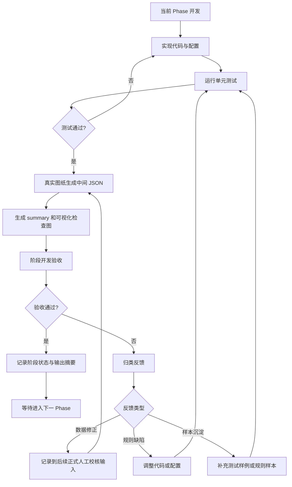
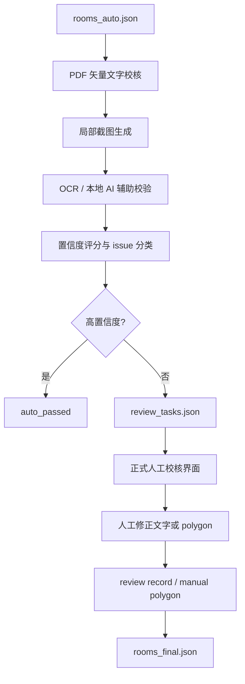

# 项目进展

## 当前状态

项目已完成 Phase 0 / Phase 1 / Phase 2 / Phase 3 的基础工程、真实文件验证、DWG 到 DXF 的本地转换能力、房间文字识别和 label 聚类，以及房间边界识别。

当前验证环境：

- Windows
- Python 3.12
- AutoCAD 2024
- `AcCoreConsole.exe`

## 当前工作流程

当前项目按 Phase 递进，但需要区分“阶段开发验收”和“正式人工校核”。

阶段开发验收用于确认当前 Phase 的中间产物是否可继续下一 Phase。它可以使用 JSON、summary 和可视化检查图，但不等同于最终业务人工校核。

Phase 3 起，人工不直接验收纯 JSON。边界类结果必须生成可视化检查图，将 CAD 底图、识别 polygon、label、状态和 issue 叠加展示，人工据此与图纸轮廓比对。

正式人工校核应放在机器校验之后，即 PDF 矢量文字校核、局部截图、OCR / 本地 AI 辅助校验、置信度评分和 review task 生成之后再进行。

已执行的实际流程：

1. Phase 0 / Phase 1 完成基础工程和 DXF 原始解析。
2. 使用真实 DWG 转换后的 DXF 生成 `cad_raw_real.json`。
3. 人工确认 DWG 转 DXF 后的 DXF 显示正常。
4. Phase 2 生成 `room_label_candidates_real.json`。
5. 人工检查 Phase 2 输出后，确认进入 Phase 3。
6. Phase 3 生成 `room_candidates_real.json`。
7. 阶段开发验收发现未匹配项过多后，回到 Phase 3 调整规则：
   - 增加 fallback 低置信度匹配。
   - 增加特殊空间分类。
   - 增加具体 issue code。
   - 增加顶层 `summary`。
8. 重新运行测试和真实图纸输出。

当前执行规范：

1. 每个 Phase 必须有中间 JSON。
2. 每个 Phase 必须用真实图纸跑通。
3. 阶段开发验收未通过时，不进入下一 Phase。
4. 阶段反馈先归类为数据修正、规则缺陷或样本沉淀。
5. 规则缺陷必须调整代码或配置，并重新生成中间 JSON。
6. 有复用价值的问题必须补测试或规则说明。
7. 正式人工校核结果优先级高于自动规则。
8. 正式人工校核应排在 PDF / OCR / 本地 AI / 置信度评分之后。

阶段开发验收流程图：



正式机器校验与人工校核流程图：



## 已完成

### Phase 0：项目初始化

- 创建 `src/room_extractor` 包结构。
- 创建 `pyproject.toml`、`requirements.txt`、`.gitignore`、`.gitattributes`。
- 创建根目录入口 `main.py`。
- 创建 CLI 入口 `room-extractor`。
- 创建基础 Pydantic models：
  - `Room`
  - `Drawing`
  - `Geometry`
  - `Confidence`
  - `Issue`
  - `ReviewRecord`
- 将日志配置迁移到 `src/room_extractor/utils/logging_config.py`。

### Phase 1：DXF 基础解析

- 实现 DXF 文件加载。
- 实现图层统计：
  - 图层名称
  - 实体数量
  - `TEXT`
  - `MTEXT`
  - `INSERT`
  - `LWPOLYLINE`
  - closed `LWPOLYLINE`
- 实现 CAD 原始对象提取：
  - `TEXT / MTEXT`
  - `INSERT` attributes
  - `LWPOLYLINE / POLYLINE`
  - bbox
  - polygon area
- 实现 `analyze-layers` 命令。
- 实现 `extract-cad` 命令。
- 对非 DXF 输入给出清晰错误，不再抛 traceback。

### DWG 转 DXF

- 新增 `convert-dwg` 命令。
- 使用 AutoCAD `AcCoreConsole.exe` 无界面转换，不调用 AutoCAD 窗口。
- 使用临时 `.scr` 脚本执行 `_DXFOUT`。
- 为避免中文路径被 AutoCAD 脚本解析错误，转换时先复制到临时 ASCII 工作目录，成功后再移动到目标中文路径。
- 支持：
  - `--input-dir`
  - `--output-dir`
  - `--recursive`
  - `--overwrite`
  - `--accoreconsole`
  - `--locale`
  - `--timeout-seconds`
  - `--dxf-precision`
  - `--keep-scripts`

### Phase 2：房间文字识别

- 新增 `build-room-labels` 命令。
- 从 Phase 1 输出的 `cad_raw.json` 读取 CAD 文本。
- 实现 CAD 文本标准化：
  - 去除多余空白
  - 统一面积单位
  - 恢复常见 GBK mojibake 中文文本
- 实现字段识别：
  - 面积：`25.60㎡`、`25.60m²`、`25.60m2`、`面积：25.60`
  - 房号：`B1-023`、`101`、`会议室 252` 等常见形式
  - 房名：办公室、会议室、贵宾室、卫生间、电梯厅、服务间、后勤用房等常见房间名称
- 实现相邻文本聚类，将房号、房名、面积合并为 `room_label_candidates.json`。
- 每个候选包含：
  - `candidate_id`
  - `floor`
  - `room_number`
  - `room_name`
  - `area`
  - `center`
  - `bbox`
  - `source_texts`
  - `confidence`
  - `issues`

### Phase 3：房间边界识别

- 新增 `build-room-candidates` 命令。
- 从 Phase 1 输出的 `cad_raw.json` 读取闭合 polyline。
- 过滤过小 / 过大的 polygon，保留候选房间边界。
- 每个边界候选输出：
  - `boundary_id`
  - `source_polyline_index`
  - `layer`
  - `polygon_cad`
  - `bbox_cad`
  - `area_cad`
- 读取 Phase 2 的 `room_label_candidates.json`。
- 使用 label 中心点匹配包含它的 polygon。
- 当多个 polygon 同时包含 label 时：
  - 优先房间边界 / 面积线图层
  - 再选择面积最小的合适 polygon
- 普通房间中心点未落入 polygon 时，支持按优先边界图层 bbox 距离进行低置信度 fallback 匹配。
- fallback 匹配输出 `matched_fallback`，并写入 `LABEL_OUTSIDE_BOUNDARY_FALLBACK_MATCH` issue。
- 客梯、货梯、电梯厅、走道、通道等特殊空间无面积时不强行 fallback，输出 `SPECIAL_SPACE_NO_AREA_BOUNDARY`，等待人工确认是否作为房间输出。
- 匹配失败时输出 `auto_failed`，并写入具体 issue code。
- 顶层 `summary` 输出状态、匹配方式和 issue 统计摘要。
- 输出 `room_candidates.json`。
- 新增 `export-review-map` 命令，输出 HTML/SVG 阶段检查图。
- 阶段检查图包含 CAD 线框底图、严格匹配 polygon、fallback polygon、未匹配 label、候选列表和 summary。

## 真实文件验证

本地真实文件：

- DWG：`data/input/cad/L2_20.00m平面图.dwg`
- PDF：`data/input/pdf/CNCCⅡ-A-207（L2_20.00m平面图）.pdf`

验证结果：

- DWG 已通过 `AcCoreConsole.exe` 成功转换为 DXF。
- 转换后的 DXF 已由人工打开确认显示正常。
- 转换后的 DXF 可被 Phase 1 命令读取。
- `analyze-layers` 成功输出真实图纸图层与实体统计。
- `extract-cad` 成功输出 `data/output/json/cad_raw_real.json`。
- `build-room-labels` 成功输出 `data/output/json/room_label_candidates_real.json`。
- `build-room-candidates` 成功输出 `data/output/json/room_candidates_real.json`。
- `export-review-map` 成功输出 `data/output/reports/room_candidates_review_real.html`。

真实 DXF 统计摘要：

- 总实体数：`16333`
- `TEXT`：`17`
- `MTEXT`：`1045`
- `INSERT`：`4056`
- `LWPOLYLINE`：`5844`
- closed `LWPOLYLINE`：`3575`

Phase 2 真实输出摘要：

- 解析 CAD 文本数：`1062`
- room label 候选数：`167`
- 同时识别到房名、房号、面积的高完整度候选数：`56`
- 输出文件：`data/output/json/room_label_candidates_real.json`

Phase 3 真实输出摘要：

- 边界候选数：`1984`
- room candidate 数：`167`
- 严格匹配到 polygon：`86`
- fallback 低置信度匹配：`25`
- 未匹配并分类为 `auto_failed`：`56`
- 特殊空间无独立边界：`54`
- 附近有边界但中心点未落入：`2`
- 同时具备房名、房号、面积且完成严格/fallback 匹配：`54`
- 输出文件：`data/output/json/room_candidates_real.json`
- 阶段检查图：`data/output/reports/room_candidates_review_real.html`

## 当前测试

已通过：

```powershell
python -m pytest
```

当前结果：

```text
22 passed
```

## 已知边界

- 当前只解析 DXF，不直接解析 DWG；DWG 必须先通过 `convert-dwg` 转换。
- 当前已做房间文字识别、房间标签聚类和闭合 polygon 匹配。
- 当前还不生成正式 `Room` 对象和 `rooms_auto.json`，这属于 Phase 4。
- 当前不做 PDF 矢量文字校核、截图或人工校核任务池。
- 常见 CAD 中文文本 mojibake 已在 Phase 2 中恢复；部分图层名或非常规文字仍可能需要后续增强。
- 部分特殊空间 label 未匹配到 polygon，已通过 `SPECIAL_SPACE_NO_AREA_BOUNDARY` 等 issue 分类记录，后续可由人工确认是否输出为房间。
- 真实数据目录和输出目录不入 Git：
  - `data/input/**`
  - `data/output/**`
  - `log/`

## 下一步建议

1. 等待人工校验 Phase 3 输出。
2. 人工确认后进入 Phase 4：生成 CAD 自动识别版房间 JSON。
3. 优先分析 `room_candidates_real.json` 中 `auto_failed` 的房间。
4. 后续根据 room label 和 polygon 生成正式 `Room` 对象并计算面积偏差。
5. 为真实图纸补充更多脱敏测试样例，避免直接提交真实项目数据。
